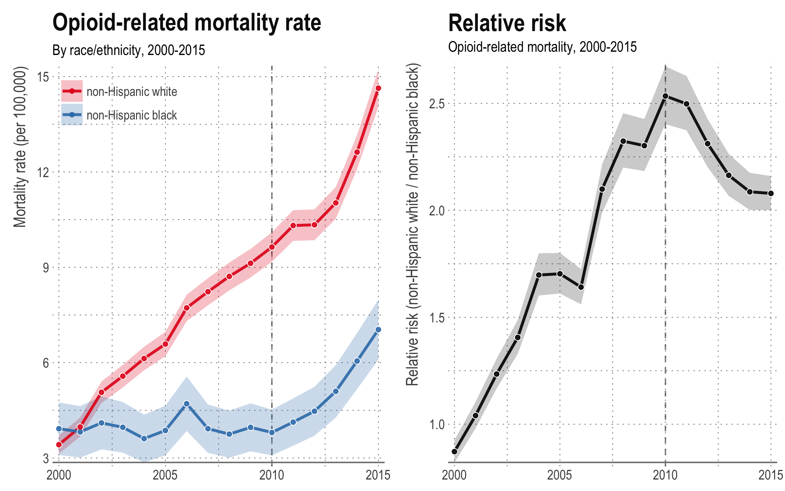

## Opioid deaths by race in the United States — 2000-2015

### Introduction
Code for a [working paper](./report/paa_2017_paper/paa.pdf) and [presentation](./report/paa_2017_presentation/paa_2017.pdf) given at [PAA 2017](https://paa.confex.com/paa/2017/webprogrampreliminary/Paper16497.html), examining differences in opioid deaths by race/ethnicity and by poly-drug use. 

Issues should be submitted [via Github](https://github.com/MJAlexander/opioid-mcd/issues) or email.

### Requirements
Our code requires the following `R` packages:

- `tidyverse`
- `ggforce` (for exploratory plots)
- `RColorBrewer`
- `viridis`
- `scales`
- `binom`
- `grid`

You can install these packages using the `./code/0_install_packages.R` script, but it does not run automatically in order to avoid forcing updates on the user.

Note that presentation versions of the plots require the font "Arial Narrow" to be installed, and may **not** render as `PDF` properly unless the device is set to `cairo_pdf`.

### Reproducibility
To reproduce paper or presentation plots (including downloading the raw multiple cause of death data, raw population count data, raw standard population data, and the processing of all raw data), just set your working directory to this folder and run `./code/0_reproduce_everything.R`. 

The script will check to see if you already have downloaded and/or processed data and will not repeat those tasks if so. It will, however, overwrite existing plots.

Please note that even with a reasonably fast internet connection and processor, going from zero data to paper plots will take (at least) an hour or so. 

Lastly, an additional presentation was given at UMass Amherst. To reproduce those plots, just run `./reports/umass_presentation/0_generate_amherst_plots.R`

### Authors
- [Monica Alexander](http://monicaalexander.com) ([GitHub](https://github.com/MJAlexander))
- [Magali Barbieri](http://www.demog.berkeley.edu/directories/profiles/barbieri.shtml)
- [Mathew Kiang](https://mathewkiang.com) ([GitHub](https://github.com/mkiang))
